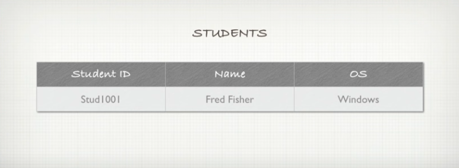
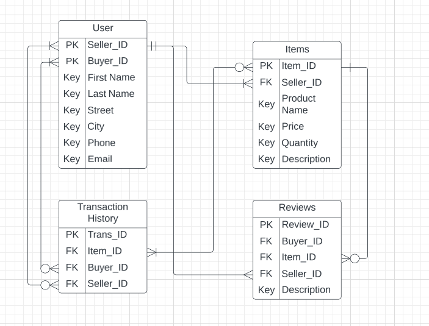

# Assessment T2A1 - A - Workbook

## Q1 > Describe the architecture of a typical Rails application

A Typical Rails Application will follow the MVC Architectural design pattern. This a design pattern that brakes down the application in to three main parts with specific functions. These are Model, Views and Controller.

Model represents and manages the content or data in the application and is responsible for connecting to the database and retrieving and modifying content. Below shows an example of Model code that is detailing the table structure of the database to ensure data is collated and kept in order.

View is the interface for the application user. It is responsible for displaying content on the users screen and what the user interacts with. Image below shows an example of View code that is based on a html template, and uses a combination of css, scss, html and ruby code in order to script a presentable webpage to be displayed on the users terminal.ß

Controller is the brain, user interacts with the controller to get the content to display and to update the content based on user interaction. Image below shows an example of Controller code that is filled with action methods for all the CRUD actions that might want to be performed. CRUD stands for Create, Read, Update and Destroy in regards to database data.

## Q2 > Identify a database management system (DBMS) commonly used in web applications (including Rails) and discuss the pros and cons of this database

A Database Management System(DBMS) commonly used in Rails Web Applications is PostgreSQL. It is an open source DBMS that can be run on all platforms. PostgreSQL has been around and available to use since the late 90s and therefore has built up a independant support community for updating and solving any issues when working with the database. This DBMS has similar features to big database players such as Oracle and DB2.

PostgreSQL is know for its features such as being able to define your own Data types and index types which makes it highly extensible. It also supports both Relational and Non-Relational Querying and its Reliabilty from its "write ahead logging" makes it a highly fault tolerant database (Sharda. A, 2021).

Pros of PostgreSQL

- Highly Fault Tolerant
- open source code means you can modify and implement as per your business needs.
- low maintainence and administration
- supports geographic objects

Cons of PostgreSQL

- Being open source, means there is no warrenty
- performance-wise, is slower than MySQL
- PostgreSQL is more about compatibility then Speed
- There is an industry preference to MySQL over PostgreSQL.

## Q3 > Discuss the implementation of Agile project management methodology

Agile project management is a now a way to plan, perform and impliment software changes to products at a speed that the industry and the consumer expects. The traditional project management style was known as Waterfall. This involved heavy planning, docummentation and Development. The goal would be to create a product and release it to the consumer as a 100% complete project. This would take a lot of time and is not as dynamically reactive to industry changes and market input as Agile.

Agile Core Philisophy is simple. It is about responding to market user input fast. Breaking this input down into specific tasks. Allocating the tasks or modifications to smaller cohorts of developers and having a short timeline for each Cohort o complete the specific task and upload.This is refferred to as ' Sprints '.

Most larger scale Software companies adopt the Agile Methodology as it allows them to have faster adaptability to their users experience and feedback, helping to shape the ever changing 'final' product to be the best customer user experience. This process is in continous cycle and can be seen as ongoing updates to software.

These Agile Principle can be applied a number of different ways dependant on what works best for your design team. This is refferred to as Methodologies. The three most popular methodologies are Scrum, Kanban and Extreme Programming

### Scrum Agile Methodology

The specifities of the Scrum Methodolgy lay in the Sprint. Scrum sprints are broken into 4 parts.
Sprint Planning - A Team meeting occurs to decide what is in the individual sprints. Nothing can be added to a sprint until it is complete.
Sprint Demo - Where the individual teams come together to show what they have indiviudally achieved as a final product
Daily Standup - this is where the teams communicated with status updates and any workflow issues they are having to the other teams.
Retrospective - This is a final meeting once the current sprint is complete to review the process and find ways to improve it.

The teams will also use a 'Scrum Board' that has all the sprint information of tasks, responsabilities and timelines on it. This creates greater transparencym in process.

### Kanban Agile Methodology

Instead of the focus being on the Sprints, Kanban places the emphasis on the tasks themselves. Refering to them as "work in progres tasks", the difference to Scrum is as follows.

- The use of a workboard like Trello for example where the tasks are seperated into three subheadings, 1. To do 2. Doing and 3. Done.
- The developer focus is on the tasks so as new tasks populate the work board they get added to the TO DO column of the whiteboard for allocations
- As there is not strict schedule to adhere to in Kanban, Developer teams can can release their complete task for software updating once tasks on the workboard are completed.

### Extreme Programming Agile Methodology

Extreme Programming(XP) is by its name extreme. Involving shorter time spints, generally 1 to 3 weeks long. This Methedology involves a higher level of customer interaction and feedback. Modifications or updates sprints are done and customers give user experience feedback immedietly, this then directly shapes the next sprint of mods or design. This process repeats until the final product is ready for release.

(MacKay. J, 2018)

## Q4 > Provide an overview and description of a standard source control workflow

Source Control is the process of tracking and updating changes to code. Whether you are working by yourself or there are multiple developers working on a coding project, it is important to manage things like which version you are working on, or if changes are going to be uploaded to the main version etc. This helps for situations like having a backup if your computer looses the copy you are working on, protects the project from fatal errors or from changes you want to remove to a previous version.

The most popular source control in use is Git. Git has many version such as GitHUB, GitLab or Bitbucket. The Process is as follows:

- Create a local Git Repository on your computer for your current project
- Create a Server-side Repository on your online GitHub account
- Push the local Git to the online git and thats your backup no matter what you do.

Source Control Workflows are a specific way to use systems like Git efficiently. Older methods like GitFlow have been become less popular in favor of Trunk-Based workflows like Centralized Workflow or Feature Brance Workflow. For your reference, Trunk-based workflows refer to the process of uploading code changes to the main file, or the " trunk of the tree".

### Git Feature Branch Workflow

Feature Branch Workflow is the workflow management process of using branching specifically for features and issue resolution. As a developer, instead of doing your new work and uploading it the main repository, you can do it on a newly generated branch. This ensure you have no effect on the main file, and reduces the risk of errors to already functioning software.

Once you have completed the feature or issue resolutions, you can upload it to the central repository without integrating it into the main branch. This allows your team members to check your work and determine there is nothing fatal to the main branch. Then your feature code can be added to the main branch via merge and then the main branch can be updated to the Central Repository.

This process creates a clear record of work performed and by who. It allows stages of peer proof reading and never allows the new, unknown code to risk the older proven code.

(Atlassian, n.d.)

## Q5 > Provide an overview and description of a standard software testing process (e.g. manual testing)

Software testing is an important part of the software development process. As a product, you want it to work as designed, to not break and to ensure an excellent user experience. So testing, otherwise known as Debugging, is crucial to the process.

Because of the fast pace program development and software updating now takes, 'continuous testing' occurs. This is where instead of waiting to test a final product at the end of development, it is done through every stage of development. This method is postive because you can catch errors early on and they are not cost intensive to resolve. It can be negative because they can be missed or not resolved in the timeline available before release. This is why you will find regular software updates are an accepted part of software in general because they may be patches or bug repairs.

Testing can be performed manually which would be efficient for smaller projects, however large projects adopt automatic software testing as well.
Manual testing is the process of a developer clicking throught the program, entering information and attempting to get it to break.
Automatic testing is the process of pre writing a script that the software goes through automatically. Testing what is designed to be tested, with the preset data points already established.

When you are setting up manual or automatic testing systems, things to consider are

- does the system do as designed
- how well does the system perform under load, whether that be lots of users or large data to process
- do individual features of components of the larger program work well in isolation
- does the software perform properly when used 100% in the same manner as the customer.

## Q6 > Discuss and analyse requirements related to information system security and how they relate to the project

Web applications are responsable for the majority of security breaches. Whilst a program may have been engineered by a security minded developer and the server side is solid, the GUI interacts with non security trained users and is more suceptable to compromise.

Users will need to know that their personal information is kept safe. The three main requirements of Information security are as follows:

- Confidentiality, ensuring data is only accessable by those who are authorised to do so.
- Integrity, ensuring fundemental changes to the system can only be performed by authorised people.
- Availability, ensuring that the system is always accessible to those who are are authorized.

The Marketplace app, will require User logon generation to make any changes to the system. Whilst anyone can access the website and peruse the content without having to login, once the user wants to add personal information to the website, a User name and Password is required. This is because in using the marketplace app, posting personal contact information and any other personal data that may help marketing in the future, or perhaps saved banking details for online sales and/or purchases, the User needs to feel safe that this information is Confidential and uncompromisable.

User authentication can go beyond logon ID and Password, confirmation passcodes can be sent to the listed email or phone number originally entered in user setup to ensure the person who has entered the logon id and password is the person who set up the account. This is called Two - Stage Verification, a process widely used in the finance industry.

## Q7 > Discuss common methods of protecting information and data and how you would apply them to the project

1.  User ID and Password. The User cannot access their personal information on the Marketplace app until they identify that they are them. Making logons and passwords private and complicated will increase the security to users data on the marketplace app.

2.  Session security. To improve user experience, most programs are set up so you dont need to keep entering your user ID and password continuiously. This is called Sessions. Sessions refer to the current state of a logged in user. Every request of the website will generate a referral to the Login ID so the program knows to keep showing that specific Users Information. To prevent re-logins this Session ID is in the Cookie generated by the users login.

To prevent user Cookies being stolen by Antagonists, cookie transfer over networks are automatically protected by SSL when your Marketplace App is designed using Rails Framework. You can also protect the relationship between user id and terminal cookies by setting expirations times on relevent cookies or ensureing the server-side storage of cookies are encrypted.

3.  Positive and Negative Captchas. An excellent way of verifying that a user is not a robot and a feature of rails plug-in, reCAPTCHA. A positive captcha determines if a human is a human, a negative captcha determines if a robot is a robot.

4.  Logging. Normally all requests are logged in rail log files. However you can enter specific restrictions into config.filter_parameters to select which details you dont want logged. Relevant to the marketplace app, this can include login details, passwords and credit card details.

(ruby on rails, n.d)

## Q8 > Research what your legal obligations are in relation to handling user data and how they can be met for the project

What are the obligations

The General Data Protection Regulations(GDPR) are a set of obligations revolving around personal data and how it is handled. Whilst only relevent to the citizens of the European Union, seeing as the internet has no borders, it is general concessus that the regulations apply to everyone dealing in personal data world wide.

A very large document, can be summed up in the following obligations:

- the actions and intentions with personal data must be handled lawfully and with transparency
- data must only be used for the intended purpose
- you must only accrue the minimium amount of information needed to perform the advertised action with said data and only for the required time to complete the task.
- the data must be secured
- there must be accountability for obligation compliance.

For a Marketplace App the following different ways can be implimented to ensure legal complaince:

- Data privacy documents can be added to workplace training manuals to ensure all workers handling personal data are aware of their personal legal responsability.
- A specific person usually called a "Data Protection Officer" can be employed to enfore compliance to regulatory obligations regarding personal data.
- Ensure Legal contracts with third party associations include protections and compliance requirements regarding personal data.
- Use Logon ID and password verification.
- Increase security by adding two-step Verification and/or Biometric scanning.
- Ensure all data transmission in encrypted.
- Ensure Personal Data is only accessible by the select few who require access to it. ie. no non-technical people or people off project.
- ensure that consent to handle and process personal data is clear in its question of the user , we can ensure this is asked of the user and evidence of consent will be recorded with personal data of individual user.
- Ensure there is an accessable Terms and Conditions on the website and any direct correspondance with users via email. These terms and conditions will have inclusions for our legal obligations regarding user personal data.

There is no trade off for one or the other. We can impliment all steps for securing the Marketplace users personal data and meeting legal obligations.

(GDPR n.d)

## Q9 > Describe the structural aspects of the relational database model. Your description should include information about the structure in which data is stored and how relations are represented in that structure.

Structurally, the Relational Database Model looks like a table. Each Column represents an particular data type and each row represents a collection of data entered that is in relation with each other. Because every piece of data entered into the database could be different and some could be identical, to differentiate between different rows of data, a Primary Key is used. This Primary Key is used to identify every row entry of information and ensure it is different from the other. A Great example would be student ID numbers. there may be 2 John Does enrolled in the school, but their collected information can be differentiated from each other because of the unique Primary key allocated to them when their data was entered in to the table.

How a table makes a relationship with another table is through these Primary Keys. In the Marketplace app, we will set up a table with all the users individual information. Allocate that user a specific Primary Key. When they go to list an item for sale in the Marketplace, when they go to the Item for sale Table. This entry will have its own Primary Key but will also have the primary key for the seller. A primary Key in a table that is not in its native table is called a foreign key and will be treated as data in the item for sale table.

## Q10 > Describe the integrity aspects of the relational database model. Your description should include information about the types of data integrity and how they can be enforced in a relational database.

Relational databases are subject to three types of 'Integrity Constraints'. Domain, Key and Referential.

Domain Integrity. When creating a database, we can set the parameters of the individual table rows. In order to achieve quality and relavent data input we can control the type and condition of data to go in each individual row. For example we can set the phone number data column to only accept Integers. Or we can enforce that a customer name entry can not be nothing. By coding 'value not NULL', we can wash the user input to ensure its format matches the rest of its column peers and there for is usable info.

Key Integrity. Primary Keys are a main feature of the database tables. For each table the Primary Key has to be unique, non repeating and cannot be null or empty. This condition ensures every piece of entered data is useable and limits the risk of error or unusable data.

Referential Integrity. Foreign keys is the feature of reffering to another data file in another table. For example when a customer sets up an account, that is one table with their information and their unique key. Then a second table might show all sales . Thsi table will refer to a primary key for the sale and the primary key for the user who bought it, In this mode the primary key used out of its original tbale is called a foreign key. Ensureing the relationship between all data by referring to other data tables means not data floats around lost.

(Peterson R 2022)

## Q11 > Describe the manipulative aspects of the relational database model. Your description should include information about the ways in which data is manipulated (added, removed, changed, and retrieved) in a relational database.

SQL, Structured Query Language is the most common language used for manipulating database data. This language uses the CRUD acronym, standing for Create, Read, Update and Destroy.

Create : The Create action will add a new row of information to a Database Table. As it is a new entry it will also give the entry a new Unique Key, or Primary Key, and place the information at the bottom of the relevant database table.

Read : The Read action will not modify the database in anyway. It will bring the requested information out and display it. It will not remove it in doing so and dependant on how specific your Read Instructions are it can display whole databases or specific information dependant on the search criterea it is coupled with.

Update : The Update function is to modify existing database data entries. Dependant on the requirements, changes can be made to individual data points in individual rows, or more broadly across several rows if relevant. THe position of the updated data row will not change when updated.

Destroy : The Delete function is to remove data from the database. This can be done by specifically calling a Unique ID, or can be done by calling destroy on a specific data condition. In regards to the latter, any data row that meets the condition will then be deleted.

(Codcademy n.d)

# Conduct research into a marketplace website (app) and answer the following parts:

## Q12 a. List and describe the software used by the app.

"Ebay' is a marketplace application that allows people to list items for sale and buy items for sale.

The Programming languages used are Javascript, Java, Marko and ES6.
The Platform the programs are written upon is Node.js.
The Database software used is Oracle.
The Payment system used is PayPal.
The Data analytics system used is KISSmetrics, Keen and Flurry.
The DevOps software used are Docker, Jenkins, BRowserstack, Pingdom and Alertbot.
The Business tools used in are WOrdpress, G Suite, InVision and Balasamiq

## Q12 b. Describe the hardware used to host the app.

There is not much information on the internet in regards to this, however the server structure Ebay maintains is the following. Web servers interact with the Web User, that they communicated either to Application Servers or Search Servers. These Servers then interact with the Data servers. It is a type of Grid Computing that allows scalability because you can just continue to add servers and in any location around the world increase the qwuality of web download and response times. In 2005 the Servers have between 6 to 12 Microporcessers each, and there was about 220 servers already. The ratio between search to data servers was 1 to 10 at the time.

Now days server technology has a minium technology requirement of 2.4ghz, 4 CPU Cores and 150gb to 300gb HHD.

## Q12 c. Describe the interaction of technologies within the app

Node. JS is a Platform used to build large scale application that will be on the Internet. It uses languages like Javascript and Java. ES6 is the updated version of Javascript. Hadoop is used because EBAy is a large server application. It is used to assist in taking advantage of large process power when dealing with large data quantities. Oracle is the Relational Database software it uses for storing and ordering the large data EBAY manages.

## Q12 d. Describe the way data is structured within the app

The App Ebay uses is called Oracle. It is a Relational Database Management System. This means data is stored in tables. Each Table will be titled with a relavent heading for that collection of data. For Example, User Info or Product info or Purchase info. Each Data Table will have a unique identifier in the table, a non repeating ID for each row entry of information so similiar or identical data can be discerned as different relevant information.

## Q12 e. Identify entities which must be tracked by the app

The Entities would be broken up in to the following datatables.

Users - people buying and/ or selling items on ebay

Items - items listed for sale

Transaction History - For Purchases

Buyer reviews - Feedback on specific sellers

## Q12 f. Identify the relationships and associations between the entities you have identified in part (e)

users - can have many items, have one transaction history and many buyer reviews

items - many items to 1 user

transaction history - many transactions to 1 user

buyer reviews - many reviews to 1 item.

## Q12 g. Design a schema using an Entity Relationship Diagram (ERD) appropriate for the database of this website (assuming a relational database model)

## References

- What is PostgreSQL? Introduction, Advantages & Disadvantages, April 29, 2021 Sharda. A, https://www.linkedin.com/pulse/what-postgresql-introduction-advantages-disadvantages-ankita-sharda/

- The Ultimate Guide to Implementing Agile Project Management (and Scrum), January 11, 2018 Mackay. J, https://plan.io/blog/what-is-agile-project-management/

- Git Feature Branch Workflow, Atlassian Website, Viewed 4 July, 2022, https://www.atlassian.com/git/tutorials/comparing-workflows/feature-branch-workflow

- Securing Rails Applications, Rails Guides, Viewed 5 July, 2022, https://guides.rubyonrails.org/security.html

- What is GDPR, the EU's new data protection law?, Viewed 6 July 2022, https://gdpr.eu/what-is-gdpr/

- Relational Data Model in DBMS | Database Concepts & Example, June 4, 2022 Peterson R, https://www.guru99.com/relational-data-model-dbms.html

- What is CRUD?, Codecademy, Viewed 6 July 2022, https://www.codecademy.com/article/what-is-crud
